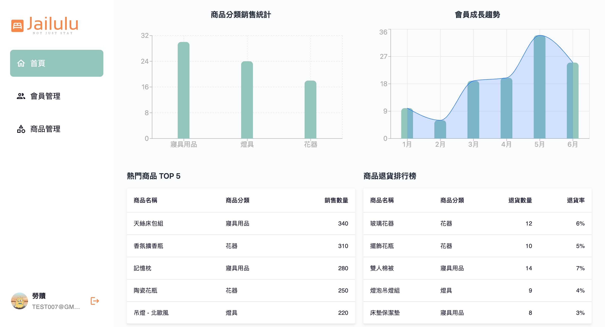

# 【Jailulu 宅家飾】後台管理系統

- [DEMO](https://jailulu-dashboard.vercel.app/)

## 簡介

###

以 Firebase 為後端服務，整合會員管理、商品 CRUD、圖片上傳與數據視覺化，並使用 React Router 建構多頁式後台操作介面。

## 網頁架構

###

- 首頁
  - 資料分析
- 會員管理
- 商品管理
  - 新增、編輯、商品上下架
- 會員
  - 資料修改

## 使用技術

###

- React 19
- React Router v7
- TypeScript
- Material UI
- Tailwind CSS
- React Hook Form
- Recharts — 圖表視覺化工具，用於會員成長 / 銷售數據呈現
- Firebase — 提供會員驗證與資料儲存功能
- Cloudinary — 圖片上傳與管理服務
- Vercel — 專案部署

## 作品介紹

### 【會員登入】

### 【首頁】

### 【會員管理】

### 【商品管理】

#### 新增商品

#### 編輯商品

### 【會員資料】

